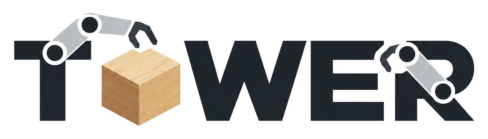
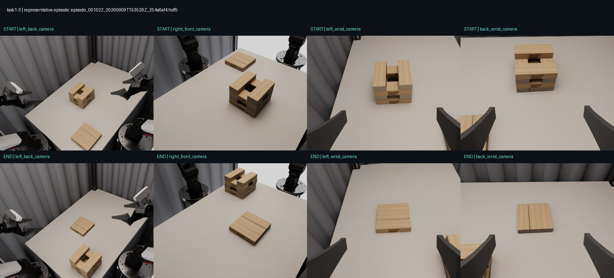
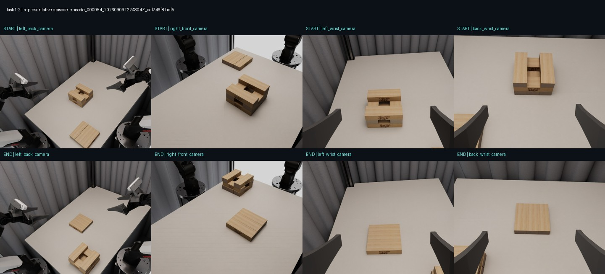
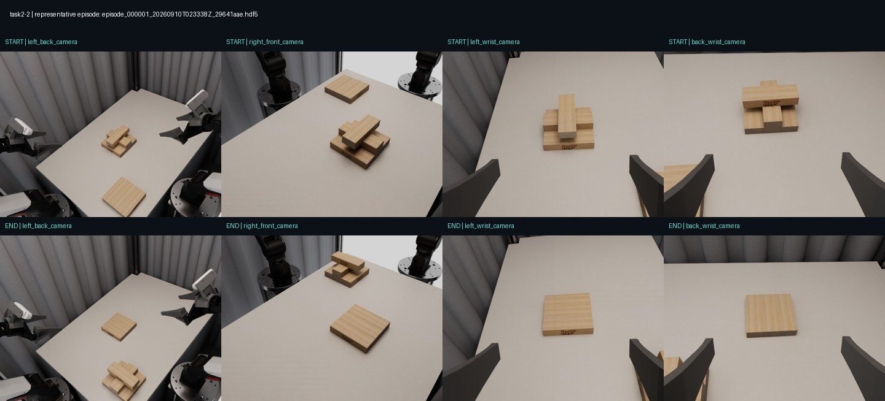
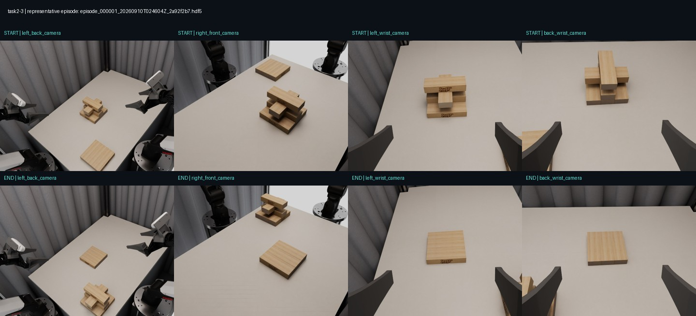
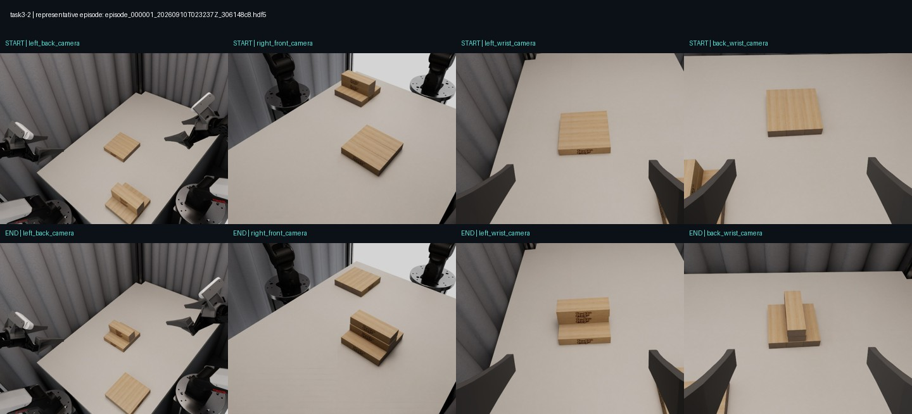
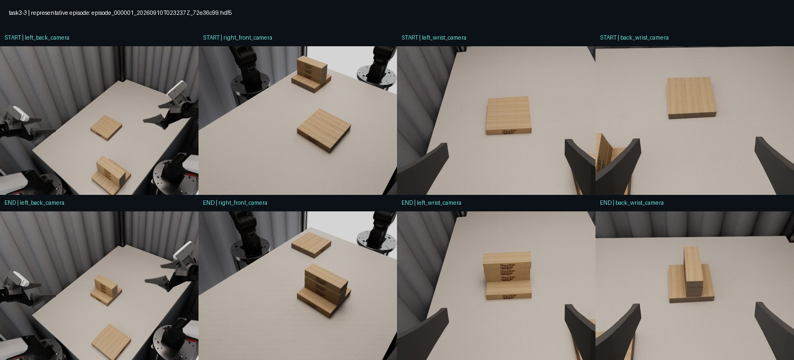
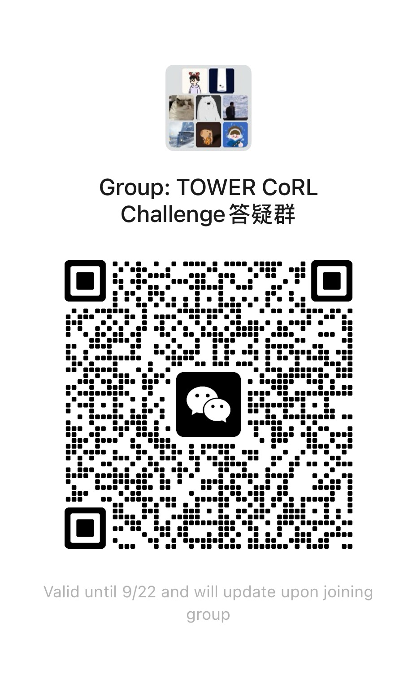

<div align="center">
  
  <h1>TOWER CoRL Challenge</h1>
  <p><strong>Long-horizon bimanual tower manipulation · <a href="https://actiongapworkshop.github.io/">G2A: From Generative Models to Robot Actions (CoRL 2026 Workshop)</a></strong></p>
  <p>
    <a href="#how-to-participate">Participate</a> ·
    <a href="#submit-your-run">Submit your run</a> ·
    <a href="docs/protocol.md">Protocol</a> ·
    <a href="README_zh.md">中文说明</a>
  </p>
  
</div>

Long-horizon bimanual block-tower manipulation in simulation. Train a policy on
**TOWER-SimData**, serve it behind a WebSocket endpoint, and the organizers evaluate it
in the TOWER Isaac Sim benchmark. **You do not need to install Isaac Sim or the benchmark.**

> Status: draft. Items marked **TBD** will be announced here and in the workshop WeChat group.

## Resources

| Resource | Link |
|---|---|
| Training data (331 episodes, 225 GiB, HDF5) | [tower-benchmark/TOWER-SimData](https://huggingface.co/datasets/tower-benchmark/TOWER-SimData) |
| Simulation assets | [tower-benchmark/TOWER-Assets](https://huggingface.co/datasets/tower-benchmark/TOWER-Assets) |
| Benchmark | [tower-benchmark/TOWER](https://github.com/tower-benchmark/TOWER) |
| Policy server protocol | [docs/protocol.md](docs/protocol.md) |
| Leaderboard | **TBD** |

## Tasks

| Task | Name | SimData folder |
|---|---|---|
| Task1-2 | Tower Transfer, 2 layers | `task1-2_tower_transfer_2` |
| Task1-3 | Tower Transfer, 3 layers | `task1-3_tower_transfer_3` |
| Task2-2 | Cross Tower Transfer, 2 layers | `task2-2_cross_tower_transfer_2` |
| Task2-3 | Cross Tower Transfer, 3 layers | `task2-3_cross_tower_transfer_3` |
| Task3-2 | Vertical Stacking, 2 layers | `task3-2_vertical_stacking_2` |
| Task3-3 | Vertical Stacking, 3 layers | `task3-3_vertical_stacking_3` |

Two AgileX Nero 7-DoF arms (`left`, `back`), four RGB cameras, 30 FPS demonstrations,
18-D absolute action. SimData has no official split; all episodes may be used for training.

Each preview shows the first frame (top row) and last frame (bottom row) of one demonstration
from the four cameras.

<table>
  <tr>
    <td align="center"><br/><b>Task1-2</b> Tower Transfer, 2 layers</td>
    <td align="center"><br/><b>Task1-3</b> Tower Transfer, 3 layers</td>
  </tr>
  <tr>
    <td align="center"><br/><b>Task2-2</b> Cross Tower Transfer, 2 layers</td>
    <td align="center"><br/><b>Task2-3</b> Cross Tower Transfer, 3 layers</td>
  </tr>
  <tr>
    <td align="center"><br/><b>Task3-2</b> Vertical Stacking, 2 layers</td>
    <td align="center"><br/><b>Task3-3</b> Vertical Stacking, 3 layers</td>
  </tr>
</table>

Preview images are from [TOWER-SimData](https://huggingface.co/datasets/tower-benchmark/TOWER-SimData) (CC BY 4.0).

## Timeline

| Date (AoE) | Milestone |
|---|---|
| **TBD** | Challenge opens, registration starts |
| **TBD** | Round 1 submission deadline |
| **TBD** | Final submission deadline |
| **TBD** | Results and workshop presentations |

## How to participate

1. **Register** your team: **TBD** (form link).
2. **Train** a policy on TOWER-SimData (any architecture; declare any extra data).
3. **Serve** it with [`policy_server/serve_policy.py`](policy_server/serve_policy.py), or your
   existing openpi server. Only `Policy.infer` needs to change:

   ```bash
   pip install -r requirements.txt
   export TOWER_API_KEY=$(python -c 'import secrets; print(secrets.token_urlsafe(32))')
   python policy_server/serve_policy.py --port 8000 --checkpoint /path/to/ckpt
   ```

4. **Expose** the port so the evaluator can reach it. No public IP, domain, or payment is
   needed: a free [Cloudflare Quick Tunnel](https://developers.cloudflare.com/cloudflare-one/networks/connectors/cloudflare-tunnel/do-more-with-tunnels/trycloudflare/)
   works without an account. Step-by-step guide: [docs/public_endpoint.md](docs/public_endpoint.md).

   ```bash
   cloudflared tunnel --url http://localhost:8000
   # prints https://<random-name>.trycloudflare.com -> submit wss://<random-name>.trycloudflare.com
   ```
5. **Self-check** from a machine outside your network, exactly as the evaluator calls it:

   ```bash
   python tools/check_policy.py wss://your-host:8000 --api-key-env TOWER_API_KEY \
       --output check_report.json
   ```

6. **Submit your run** (below) and keep the server online during your availability window.

## Submit your run

Email **[corl_action_gap_workshop_pc@googlegroups.com](mailto:corl_action_gap_workshop_pc@googlegroups.com)** with subject `[TOWER Challenge] <team name> <model version>`.

| Item | Required | Description |
|---|---|---|
| `submission.json` | yes | Filled copy of [`submission/submission_template.json`](submission/submission_template.json): team, contact, model, endpoint, availability window |
| `check_report.json` | yes | Output of `tools/check_policy.py` against the submitted endpoint, generated within 24 h of submitting |
| API key | yes | In the email body only; use a dedicated key |
| Method description | final round | 1–2 page PDF: architecture, training data, training compute |

What happens next:

1. We run the same check against your endpoint. If it fails, we reply and the attempt is not counted.
2. Evaluation runs inside your availability window (at least **TBD** hours; all tasks, fixed
   initial layouts and seeds, hidden from participants).
3. Results are verified and published on the leaderboard, typically within **TBD** days.

Rules:

- At most **TBD** evaluated submissions per team per round; the best one is ranked.
- The endpoint must serve the same model for the whole evaluation window. Do not change
  weights or behavior between episodes.
- The policy may use only the provided observations. Human intervention, scripted access
  to simulator state, or task-specific hard-coding from test layouts disqualifies the run.
- Top teams must share inference code or a Docker image for verification.

## Evaluation

Every task is evaluated separately on fixed initial layouts with fixed inference seeds.
The simulation pauses during inference; the policy runs at 10 Hz and 16 actions are
executed per request. An episode ends on success, time limit (**TBD** per task), or a
policy error.

| Level | Metric | Definition |
|---|---|---|
| Task | Task Success Rate ↑ | fully successful episodes / valid episodes |
| Operation | Grasp Success Rate ↑ | target blocks grasped / all planned target blocks |
| Operation | Place Success Rate ↑ | target blocks placed stably / all planned target blocks |
| Long-horizon | Progress Rate ↑ | longest completed in-order prefix of task points / all task points |
| Safety | Disturbed Block Count ↓ | distinct non-target blocks disturbed per episode |

Ranking (draft): mean Task Success Rate over the six tasks, ties broken by mean Progress
Rate, then lower Disturbed Block Count, then earlier submission.

A policy error (malformed reply, disconnect, timeout) counts as a failed episode.
Infrastructure failures on our side are re-run.

## FAQ

**Do I need Isaac Sim?** No. You only host the policy; we run the simulation.

**Does my network latency affect the score?** No, the simulation waits for your reply,
up to the 60 s timeout.

**I trained with openpi / pi-0.5.** Keep your openpi `serve_policy.py`; map the observation
keys and 18-D action described in [docs/protocol.md](docs/protocol.md).

**No public IP? Do I need to register anywhere?** No. Use a free
[Cloudflare Quick Tunnel](docs/public_endpoint.md): download `cloudflared` and run
`cloudflared tunnel --url http://localhost:8000`, with no account or payment.
[ngrok](https://ngrok.com/download) also works but requires signing up for a free account
and adding its authtoken. A cloud VM with a public IP works too.

**Image resolution?** Images arrive at the simulator's native resolution; resize in your server.

## Contact

- Email: [corl_action_gap_workshop_pc@googlegroups.com](mailto:corl_action_gap_workshop_pc@googlegroups.com)
- Discord: [join the challenge server](https://discord.gg/RN4xGnMJ3G)
- Questions and bug reports: open an issue in this repository.

WeChat support group (scan to join; the code is refreshed regularly, ask on Discord or by
email if it has expired):


